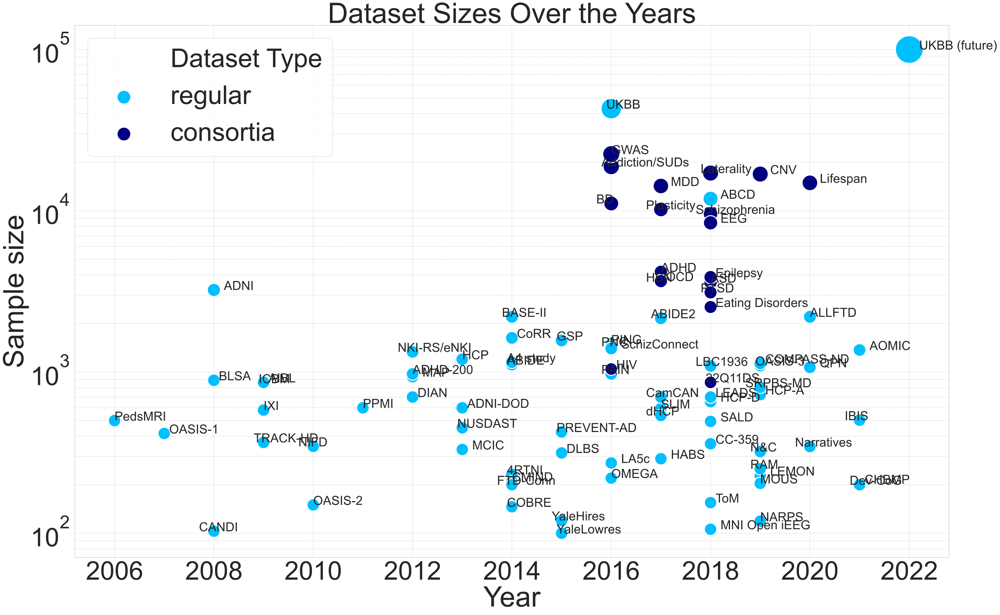
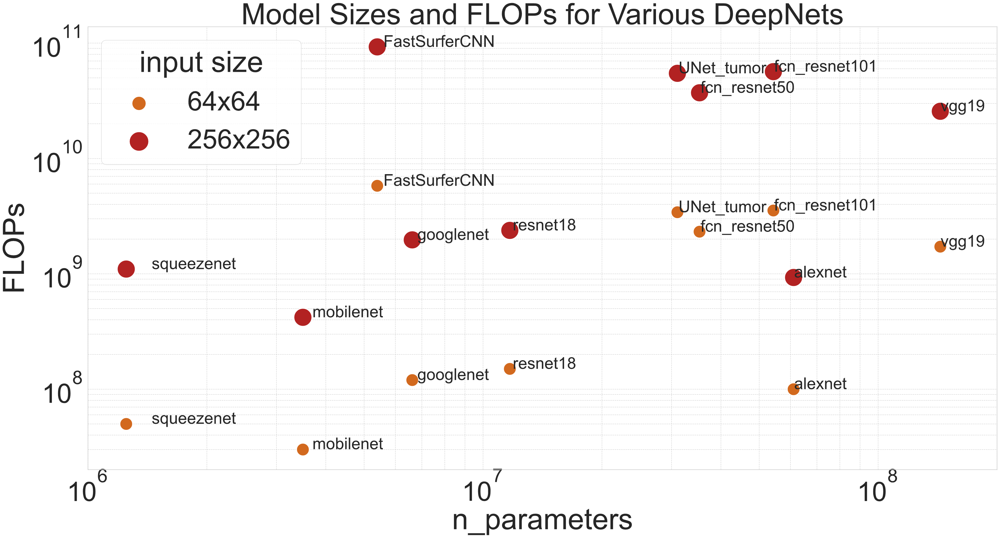
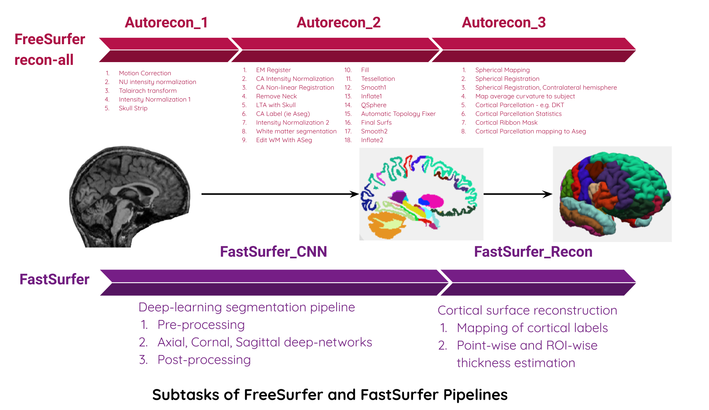

# watts_up_compute

## Code repo to assess compute costs of neuroimaging pipelines


## Motiation
- Increasing supply of large datasets and machine-learning models
- Growing demand for computational resources exceeding Moore’s law [[1](https://openai.com/blog/ai-and-compute/), [2](https://www.technologyreview.com/2019/06/06/239031/training-a-single-ai-model-can-emit-as-much-carbon-as-five-cars-in-their-lifetimes/
), [3](https://arxiv.org/abs/1907.10597), [4](https://dl.acm.org/doi/10.1145/3442188.3445922), [5](https://arxiv.org/abs/2104.10350)]
- Estimated carbon footprint of AI model: 284 Kgs of CO2 (5x lifetime emissions of a car or 300x RT-flights for single passenger between NYC and SF [[1](https://openai.com/blog/ai-and-compute/), [2](https://www.technologyreview.com/2019/06/06/239031/training-a-single-ai-model-can-emit-as-much-carbon-as-five-cars-in-their-lifetimes/
), [3](https://arxiv.org/abs/1907.10597)])


|        Dataset sizes        | Model sizes      | 
| :-------------: | :----------: | 
|| |

## Experiment objectives:
- Measure compute cost metrics:
  - model parameters
  - model FLOPs/MACs
    - [general purpose](http://www.bnikolic.co.uk/blog/python/flops/2019/09/27/python-counting-events.html)
    - [pytorch:ptflops](https://github.com/sovrasov/flops-counter.pytorch) (Primarily used)
  - model energy/power consumption
    - [pyJoules](https://github.com/powerapi-ng/pyJoules)
    - [experiment-impact-tracker](https://github.com/Breakend/experiment-impact-tracker) (Primarily used)
  - model duration: development (e.g. model traning and selection) and deployment (e.g. model run / inference) times
  - model performance (accuracy / dice score)
- Comparisons:
  - hardware: cpu vs gpu
  - datasets: cifar, kaggle (tumor MRI), ukb
  - models
    - Traditional neuroimaging pipelines (e.g. FreeSurfer)
    - DL alternatives (e.g. FastSurfer)

## Repo organization
```
.
├── FastSurfer_experiments
├── figures
├── lib
├── LICENSE
├── notebooks
├── pilot_experiments
├── preproc_pipeline_experiments
├── README.md
├── requirements.txt
├── scripts
├── slurm
└── unit_tests
```

## Notes:  
- All power consumption analyses are performed using this [repo](https://github.com/nikhil153/experiment-impact-tracker)
- FastSurfer_experiments are run using this [repo](https://github.com/nikhil153/FastSurfer)
- Pilot experiments with kaggle dataset are based one this [repo](https://github.com/mateuszbuda/brain-segmentation-pytorch)

### Current work
#### Measure the compute cost and the consequent environmental impact of 1) FreeSurfer and 2) FastSurfer pipelines. 

- Dataset: UK Biobank sample (N=72)
- Pipelines: FreeSurfer 6.0 vs. FastSurfer (deep-learning approach) 
- Volumetric brain segmentation and cortical thickness estimation with DKT parcellations (see Fig 3)
- Proc: CPU (Intel Xeon(R) Gold 6148 @ 2.40GHz) vs. GPU (Tesla V100-SXM2-16GB CUDA:11.0)
- HPC location: Compute Canada @ Quebec, Canada ([PUE](https://en.wikipedia.org/wiki/Power_usage_effectiveness) ~ 1.2)
- Compute cost metrics
  1) Runtime         2) Power draw         3) Carbon emissions
- Compute cost tracker: [experiment-impact-tracker]((https://github.com/Breakend/experiment-impact-tracker))





### Notebooks:
- notebooks/8_FastSurfer.ipynb: Compares FastSurfer segmentation and cortical thickness performance w.r.t FreeSurfer
- notebooks/10_impact_tracker_dashboard.ipynb: Generates runtime and energy consumptions plots based on experiment-impact-tracker logs in
   1) FastSurfer_experiments/results/exp_impact_tracker/ukb 
   2) preproc_pipeline_experiments/results/exp_impact_tracker/ukb. 

### Benchmark:

|        Pipeline (single run)  | Runtime (hrs): CPU        | Runtime (hrs): GPU        | Power (W-hrs): CPU          | Power (W-hrs): GPU        |  Carbon Emissions (grams): CPU        |  Carbon Emissions (grams): GPU        |
|-----------------------------------------------------|------------|------------|------------|------------|------------|------------|
| FreeSurfer    | 8.3 (1.03) | N/A        | 108.5 (19.8) | N/A        | 3.26 (0.5) | N/A        |
| FastSurfer    | 9.8 (0.74) | 1.6 (0.47) | 126.4 (16.1) | 26.7 (7.7) | 3.79 (0.5) | 0.80 (0.2) |

