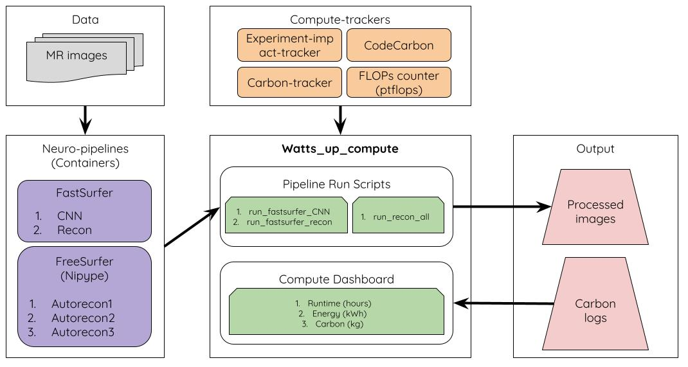

# watts_up_compute

## Code repo to assess compute costs of neuroimaging pipelines

## Motivation
- Increasing supply of large datasets and machine-learning models
- Growing demand for computational resources exceeding Moore’s law [[1](https://openai.com/blog/ai-and-compute/), [2](https://www.technologyreview.com/2019/06/06/239031/training-a-single-ai-model-can-emit-as-much-carbon-as-five-cars-in-their-lifetimes/
), [3](https://arxiv.org/abs/1907.10597), [4](https://dl.acm.org/doi/10.1145/3442188.3445922), [5](https://arxiv.org/abs/2104.10350)]
- Estimated carbon footprint of AI model: 284,000 Kgs of CO2 (5x lifetime emissions of a car or 300x RT-flights for single passenger between NYC and SF [[1](https://openai.com/blog/ai-and-compute/), [2](https://www.technologyreview.com/2019/06/06/239031/training-a-single-ai-model-can-emit-as-much-carbon-as-five-cars-in-their-lifetimes/
), [3](https://arxiv.org/abs/1907.10597)])

|        Dataset sizes        | Model sizes      | 
| :-------------: | :----------: | 
|| |

## Experiment objectives:
- Benchmark following compute cost metrics for neuroimaging pipelines:
  - model complexity (parameters, FLOPs/MACs)
    - [general purpose](http://www.bnikolic.co.uk/blog/python/flops/2019/09/27/python-counting-events.html)
    - [pytorch:ptflops](https://github.com/sovrasov/flops-counter.pytorch) (Primarily used)
  - model energy/power consumption using several carbon trackers
    - [experiment-impact-tracker](https://github.com/Breakend/experiment-impact-tracker) (Primarily used)
    - [CarbonTracker](https://github.com/lfwa/carbontracker) (in-progress)
    - [CodeCarbon](https://github.com/mlco2/codecarbon) (in-progress)
  - model runtime
- Comparisons:
  - hardware: cpu vs gpu
  
## Repo organization (ongoing)

## Preliminary results on a pilot sample

- Datasets: [UK Biobank sample](https://www.ukbiobank.ac.uk/enable-your-research/register) (N=72)
- Pipelines: [FreeSurfer 6.0](https://surfer.nmr.mgh.harvard.edu/) implementation with [Nipype](https://nipype.readthedocs.io/en/latest/users/examples/smri_fsreconall.html) vs. [FastSurfer]((https://github.com/Deep-MI/FastSurfer)) (deep-learning approach) 
- Output: Volumetric brain segmentation and cortical thickness estimation with DKT parcellations (see figure below)
- Proc: CPU (Intel Xeon(R) Gold 6148 @ 2.40GHz) vs. GPU (Tesla V100-SXM2-16GB CUDA:11.0)
- HPC location: Compute Canada @ Quebec, Canada ([PUE](https://en.wikipedia.org/wiki/Power_usage_effectiveness) ~ 1.2)
- Compute cost metrics
  1) Runtime         2) Power draw         3) Carbon emissions
- Compute cost tracker: [experiment-impact-tracker]((https://github.com/Breakend/experiment-impact-tracker))

### Compute cost benchmarks:
Note: The values in table are for processing of a single scan. A typical inference/deployment pipeline may do ~10k of these runs for a large dataset. And a model training/development pipeline may incur over 1M runs. 

|        Pipeline (single run)  | Runtime (hrs): CPU        | Runtime (hrs): GPU        | Power (W-hrs): CPU          | Power (W-hrs): GPU        |  Carbon Emissions (grams): CPU        |  Carbon Emissions (grams): GPU        |
|-----------------------------------------------------|------------|------------|------------|------------|------------|------------|
| FreeSurfer    | 8.3 (1.03) | N/A        | 108.5 (19.8) | N/A        | 3.26 (0.5) | N/A        |
| FastSurfer    | 9.8 (0.74) | 1.6 (0.47) | 126.4 (16.1) | 26.7 (7.7) | 3.79 (0.5) | 0.80 (0.2) |
